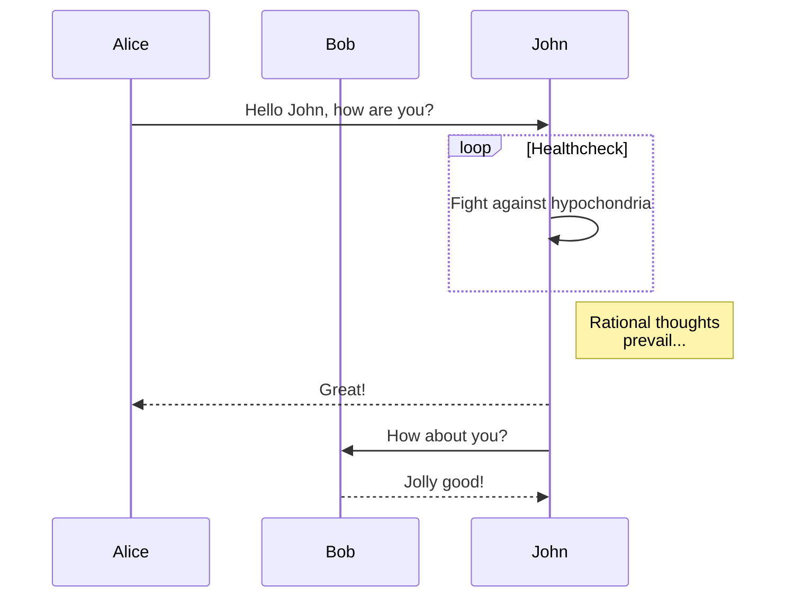

# 注意
このリポジトリでは、marmaid.jsを用いて設計図の管理を行います。github上やVScode上での表示を可能にするために以下のextensionや拡張機能をインストールすることを必要とします。ご注意ください。

- VScode
  - [Markdown Preview Mermaid Support](https://marketplace.visualstudio.com/items?itemName=bierner.markdown-mermaid)
  - [Mermaid Markdown Syntax Highlighting](https://marketplace.visualstudio.com/items?itemName=bpruitt-goddard.mermaid-markdown-syntax-highlighting)
- Chrome extension
  - [GitHub + Mermaid](https://chrome.google.com/webstore/detail/github-%2B-mermaid/goiiopgdnkogdbjmncgedmgpoajilohe/related)

