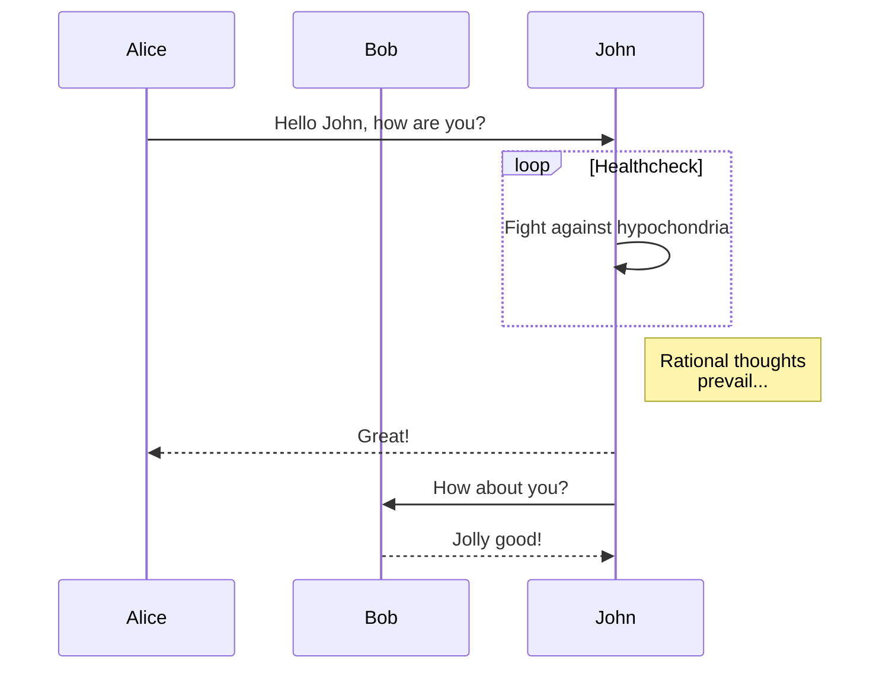

# 注意
このリポジトリでは、marmaid.jsを用いて設計図の管理を行います。github上やVScode上での表示を可能にするために以下のextensionや拡張機能をインストールすることを必要とします。ご注意ください。

- VScode
  - [Markdown Preview Marmaid Support](https://marketplace.visualstudio.com/items?itemName=bierner.markdown-mermaid)

