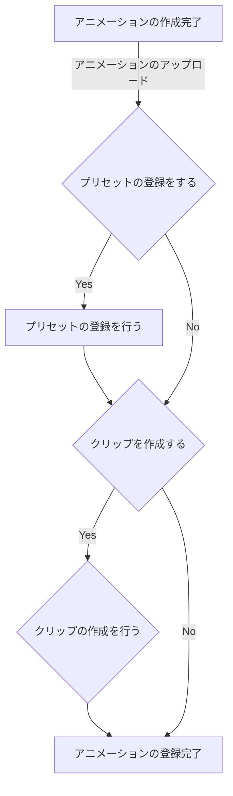

# フローチャート
## 登録の流れ
アニメーションのアップロードにおける登録の流れを示す。

```mermaid
flowchart TD
    id1[アニメーションの作成完了]
    -- アニメーションのアップロード 
    --> id2{プリセットの登録をする}
    id2 --> |Yes| id21[プリセットの登録を行う] --> id4
    id2 --> |No| id4{クリップを作成する}
    id4 --> |Yes| id41{クリップの作成を行う} --> id3
    id4 --> |No| id3[アニメーションの登録完了]
```
