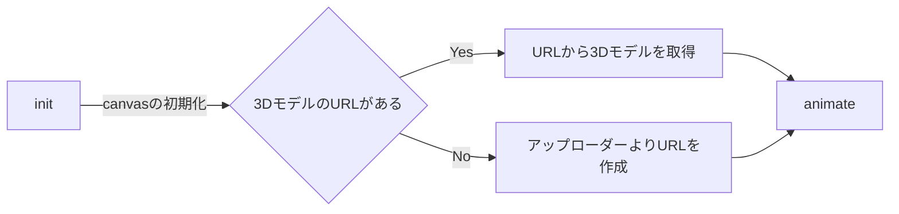
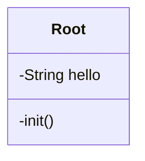

# Rendererについて
このレンダラーはアップローダーでもあります。ドラッグ&ドロップで3Dモデルをアップロードした際は、objectURLを生成します。複数回のアップロードには要対応

# フローチャート

```mermaid
flowchart LR
    id1[init]
    id2[animate]
    id1 --> |canvasの初期化| id3{3DモデルのURLがある}
    id3 --> |Yes| id41[URLから3Dモデルを取得] --> id2
    id3 --> |No| id42[アップローダーよりURLを作成] --> id2
```

# クラス図

canvas 関連のクラス図。この図を見れば、変数などの流れがわかるはず

```mermaid
classDiagram
class Root{
  -String hello
  -init()
}
```