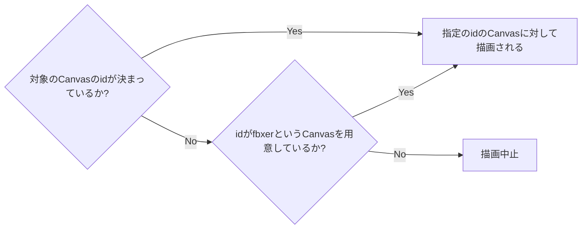
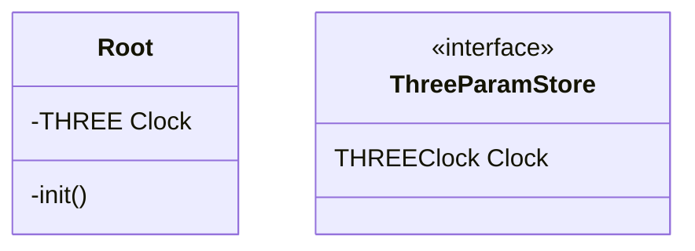

# Renderer について

このレンダラーはアップローダーでもあります。ドラッグ&ドロップで 3D モデルをアップロードした際は、objectURL を生成します。複数回のアップロードには要対応

# フローチャート

```mermaid
flowchart LR

    id10{対象のCanvasのidが決まっているか?}
    id11[指定のidのCanvasに対して描画される]
    id20{idがfbxerというCanvasを用意しているか?}
    id21[描画中止]
    id10 --> |Yes| id11
    id10 --> |No| id20
    id20 --> |No| id21
    id20 --> |Yes| id11
```

# クラス図

canvas 関連のクラス図。この図を見れば、変数などの流れがわかるはず

```mermaid
classDiagram

class Root{
  -THREE Clock
  -init()
}

class ThreeParamStore{
  <<interface>>
  THREEClock Clock
}
```

